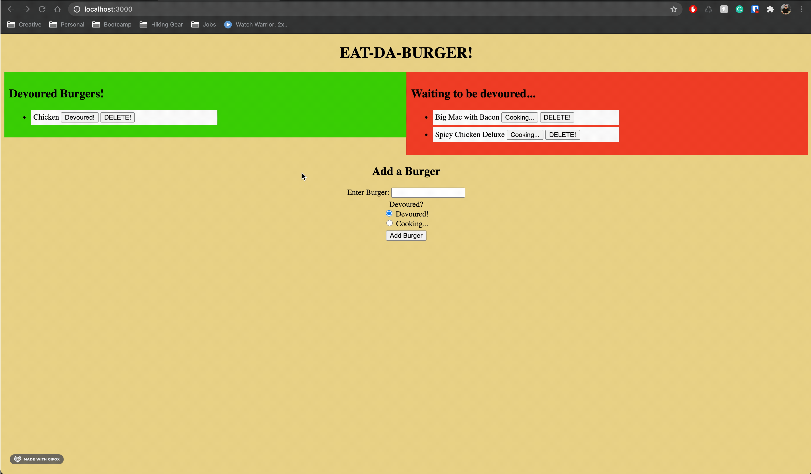

  <h1 align="center">Burger App</h1>
  
   

## Description
In this assignment, you'll create a burger logger with MySQL, Node, Express, Handlebars and a homemade ORM (yum!). Be sure to follow the MVC design pattern; use Node and MySQL to query and route data in your app, and Handlebars to generate your HTML.

## Table of Contents
  - [Description](#description)
  - [Installation](#installation)
  - [Usage](#usage)
  - [License](#license)
  - [Contributing](#contributing)
  - [Questions](#questions)

  ## Installation
  First run `npm i` in order to install the dependencies. The application itself can be invoked with `node server.js` in the intergreated termeinal.

  You must also have [MySQL Workbench](https://dev.mysql.com/downloads/workbench/) to run the `schema.sql`. You must create, use, and insert the `burger_db`. 

  (currently not working) Here is a link to the deployed site on [heroku](https://blooming-oasis-28510.herokuapp.com/).

  ## Usage
  When you run `server.js` in the intergrated terminal, it'll log you with a local host. Insert that in your URL and the webpage will show. 

  

  ## License
  [MIT License](https://choosealicense.com/licenses/mit/)

  ## Contributing
  Please contact with me any errors or improvements you may have. See the [Questions](#questions) section to contact me.

  ## Questions
  - My GitHub profile: [justinkvang](http://github.com/justinkvang)
  - My GitHub repository: [justinkvang](http://github.com/justinkvang?tab=repositories)
  - Email me with any questions: justinvang07@gmail.com